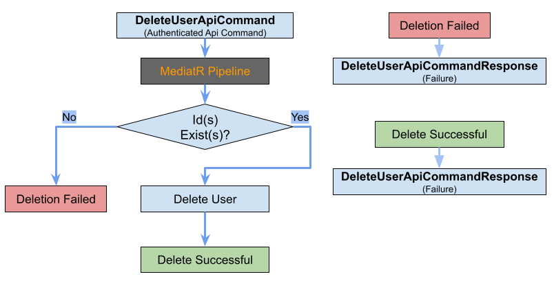

# Felhasználó Törlése Funkció

## Áttekintés
A `DeleteUserFeature` lehetőséget biztosít az adminisztrátorok számára a felhasználók törlésére a rendszerből. Ez a funkció biztosítja, hogy a felhasználói adatok megfelelően törlődjenek az adatbázisból, fenntartva a rendszer integritását és biztonságát. Kiemelten fontos a felhasználói fiókok kezelése szempontjából, valamint annak biztosítása érdekében, hogy csak jogosult felhasználók férjenek hozzá a rendszerhez.



## Folyamatleírás
A `DeleteUserFeature` az alábbi lépésekben működik:

1. **Kliensoldali kérés**: A kliens kezdeményezi egy vagy több felhasználó törlését.
2. **API kérés**: Egy API kérés kerül elküldésre a törlés végrehajtásához.
3. **Validáció**: Az API kérés ellenőrzése, hogy érvényes felhasználói azonosítókat tartalmaz-e.
4. **Parancs feldolgozása**: A `DeleteUserApiCommand` végrehajtása a `DeleteUserCommandHandler` segítségével.
5. **Adatbázis művelet**: A megadott felhasználók törlése az adatbázisból.
6. **Értesítések**: Sikeres törlés esetén értesítés küldése az adminisztrátor számára.

### Részletes lépések
1. **Kliensoldali kérés**:
    - **Komponens**: `UserManagement.razor`
    - **Leírás**: A kliensoldali felület biztosítja az adminisztrátorok számára a felhasználók kiválasztását és törlését. A törlés gomb megnyomása után a rendszer elküldi a kérést a szervernek.

2. **API kérés**:
    - **Végpont**: `POST /api/v1/iam/user/batch-delete`
    - **Küldött adatok**: `{ "Ids": [1, 2, 3] }`
    - **Leírás**: A kliens egy POST kérést küld a megadott végpontra, amely tartalmazza a törlendő felhasználók azonosítóit.
    - **Miért POST?**: A POST metódus lehetőséget biztosít a kérés törzsében történő adatok küldésére, ami szükséges a felhasználói azonosítók listájának továbbításához. Emellett a POST a szerver állapotát módosító műveleteknél javasolt.

3. **Validáció**:
    - **Validátor**: `DeleteUserApiCommandValidator`
    - **Leírás**: Ellenőrzi, hogy az `Ids` mező nem üres és érvényes azonosítókat tartalmaz. Hibás adatok esetén hibaüzenetet küld vissza a kliensnek.

4. **Parancs feldolgozása**:
    - **Handler**: `DeleteUserCommandHandler`
    - **Leírás**: A parancs feldolgozása során a rendszer ellenőrzi, hogy az azonosítók léteznek-e az adatbázisban. Ha valamelyik felhasználó nem létezik, hibaüzenet jelenik meg. Érvényes adatok esetén a törlés végrehajtásra kerül.

5. **Adatbázis művelet**:
    - **Repository**: `IUserRepository`
    - **Leírás**: Az adatbázis-műveletek végrehajtása, a megadott felhasználók törlése. Biztosítja, hogy a törlés hatékonyan és biztonságosan történjen.

6. **Értesítések**:
    - **Leírás**: A törlés sikeres végrehajtása után értesítés küldhető az adminisztrátornak. Ez a lépés opcionális és a rendszer konfigurációjától függ.

## Szükséges adatok a törléshez
- **Felhasználói azonosítók**: A törlendő felhasználók azonosítóinak listája.

## Kliensoldali komponensek
- **UserManagement.razor**: Felület a felhasználók kezelésére, beleértve a törlést is.
- **DeleteUserClientCommand**: Kliensoldali parancs, amely tartalmazza a törlendő felhasználók azonosítóit.

## Szerveroldali komponensek
- **Parancsok és kezelők**:
    - `DeleteUserApiCommand`: A törlési parancs, amely a törlendő felhasználók listáját tartalmazza.
    - `DeleteUserCommandHandler`: A törlési műveletet végrehajtó handler.
- **Validációs mechanizmusok**:
    - `DeleteUserApiCommandValidator`: Ellenőrzi a parancs adatait.
- **Adattovábbítási objektumok (DTO-k)**:
    - `DeleteUserApiCommandResponse`: A törlési művelet eredménye.

## Jogosultságkezelés
- **Szükséges jogosultság**: `CAN_DELETE_USERS`
- **Felhasználói szerepkörök**: Csak az `CAN_DELETE_USERS` jogosultsággal rendelkező adminisztrátorok használhatják ezt a funkciót.

## API végpontok
- **Végpont**: `POST /api/v1/iam/user/batch-delete`
    - **Válaszok**:
        - **Sikeres törlés**:
           ```json
           {
             "Success": true,
             "Message": "Felhasználók sikeresen törölve."
           }
           ```
        - **Hibaüzenet**:
           ```json
           {
             "Success": false,
             "Message": "Nem található felhasználói azonosítók: [4, 5]"
           }
           ```

## Tesztelési stratégia
- **Egységtesztek**:
    - `DeleteUserApiCommandValidator` validációs tesztjei.
    - `DeleteUserCommandHandler` működésének tesztelése.
- **Integrációs tesztek**:
    - API végpont és a handler közötti interakció tesztelése.
- **End-to-End (E2E) tesztek**:
    - Az API kérés teljes folyamatának tesztelése.

## Tesztesetek

### Egységtesztek

#### Validációs tesztek

- **Test_EmptyIdsField_ReturnsError**: Ellenőrzi, hogy a `DeleteUserApiCommandValidator` hibát ad vissza, ha az `Ids` mező üres.
- **Test_ValidIdsField_PassesValidation**: Ellenőrzi, hogy a `DeleteUserApiCommandValidator` elfogadja az érvényes felhasználói azonosítókat.

#### Parancskezelő tesztek

- **Test_NonExistentUserId_ReturnsError**: Ellenőrzi, hogy a `DeleteUserCommandHandler` hibát ad vissza, ha egy felhasználói azonosító nem létezik.
- **Test_ExistingUserIds_DeletesUsers**: Ellenőrzi, hogy a `DeleteUserCommandHandler` sikeresen törli a létező felhasználókat.

---

### Integrációs tesztek

#### API végpont tesztek

- **Test_ValidUserIds_ReturnsSuccessResponse**: Ellenőrzi, hogy az API sikeres választ ad vissza érvényes felhasználói azonosítók esetén.
- **Test_InvalidUserIds_ReturnsErrorResponse**: Ellenőrzi, hogy az API hibás választ ad vissza érvénytelen azonosítók esetén.

---

### Végponttól végpontig (E2E) tesztek

#### Teljes folyamat tesztek

- **Test_FullFlow_DeletesUsersAndSendsNotifications**: Ellenőrzi, hogy az API kérés hatására a felhasználók törlődnek, és az adminisztrátor értesítést kap.
- **Test_FullFlow_EmptyIdsField_ReturnsError**: Ellenőrzi, hogy az API hibát ad vissza, ha az `Ids` mező üres.
- **Test_FullFlow_NonExistentUserId_ReturnsError**: Ellenőrzi, hogy az API hibát ad vissza, ha egy nem létező felhasználói azonosítót küldenek.

---

## Összegzés

A `DeleteUserFeature` egy biztonságos és hatékony módot biztosít a felhasználók törlésére a rendszerből. Csak jogosult adminisztrátorok végezhetik el a műveletet, a rendszer ellenőrzi a bemeneti adatokat, és gondoskodik az adatbázis megfelelő frissítéséről. A funkció megfelel minden biztonsági, validációs és használhatósági követelménynek, biztosítva a rendszer integritását.


