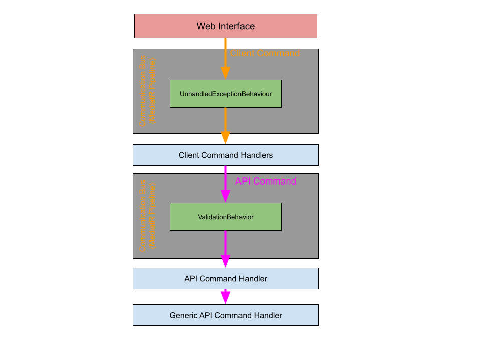

# Kliensoldali kérések feldolgozása

## Bevezetés

Ez a dokumentum áttekintést nyújt a kliensoldali kérések feldolgozásáról, részletezve a rendszer különböző rétegeinek működését és szerepét. Célja, hogy bemutassa a kliensoldali komponensek és a háttérrendszer közötti kommunikáció folyamatát az adatfeldolgozás hatékonysága és megbízhatósága érdekében.



## Webes felület

A felhasználói interakciók elsődleges pontja a webes felület, amely biztosítja a rendszer funkcionalitásához való hozzáférést. Ez a réteg korlátozott betekintést nyújt a teljes architektúra működésébe, de kulcsszerepet tölt be a felhasználói műveletek továbbításában a „Client Command” komponensek felé.

**Fájl:** `\Pages\Features\IAM\LoginPage.razor`

```c#
private async void Login()
{
    LoginUserClientCommand userClientCommand = new LoginUserClientCommand(DialogService)
    {
        Username = username,
        Password = password
    };
    await Mediator.Send(userClientCommand);
}
```

### Hibakezelés

A hibakezelési mechanizmus biztosítja, hogy a kliens- és szerveroldali problémák esetén a felhasználó megfelelő értesítést kap a **DialogService** segítségével. A hibák kezelése a probléma forrásától és szintjétől függően történik:

- **ClientCommandHandler**: Felhasználói műveletekből eredő hibák kezelésére szolgál.
- **ApiCommand**: Az `ApiCommandValidator` validálásán átmenő hibákat kezeli.
- **CommandHandler**: Adatbázis-specifikus problémák kezelésére, például duplikált e-mailcímek.
- **GenericApiCommandHandler**: API-kommunikáció során fellépő hibák kezelése.
- **UnhandledExceptionBehaviour**: "fallback line", globális kivételkezelési réteget biztosít, amely minimalizálja a rendszer váratlan összeomlását, és lehetőséget ad a biztonságos hibakezelésre. Továbbá fontos információhoz juttatja a fejlesztőt a probléma esetleges megoldásához.

A „Client Command” osztályok paraméterként kapják meg a hibakezelési információkat, így biztosítva a pontos visszajelzéseket.

## Client Command

A „Client Command” osztályok feladata a webes felületről érkező adatok előkészítése és a „Client Command Bus” által történő továbbításuk. Minden „Client Command” implementálja az `IClientCommand<bool>` interfészt, amely biztosítja a pipeline konzisztens működését.

## Client Behaviour

A „Client Behaviour” osztályok az elsődleges adatellenőrzésekért felelősek. A kérések érkezésekor lehetőséget biztosítanak a kérés elfogására, módosítására, vagy cseréjére.

- **UnhandledExceptionBehaviour**: Az ismeretlen hibák kezelésére használt, az `IClientCommand<T>` osztályokat figyeli.
- **ValidationBehaviour**: Az `ApiCommandBase<T>` osztályokat validálja, és a hibás kéréseket visszautasítja hibaüzenettel.

Ezek az osztályok biztosítják, hogy a pipeline áramlása megfelelően történjen. Ha valamelyik szakasz nem tudja kezelni a kérést, értesítést küld a felhasználónak, sikeres ellenőrzés esetén pedig folytatódik a feldolgozás.

## Client Command Handler

A `ClientCommand` objektumokat a MediatR keretrendszer továbbítja a `ClientCommandHandler` osztálynak, amely feldolgozza a kérést és továbbítja az API felé. Ez a réteg elvégzi a backendre nem vonatkozó ellenőrzéseket, és az API válaszainak feldolgozásáért is felelős.

## API Command

Az API-val való kommunikációhoz szükséges paraméterek az API Command osztályokban vannak definiálva. Ezek az osztályok a MediatR segítségével továbbítják a kéréseket a „GenericApiCommandHandler” felé, amely az adott endpointra vonatkozó műveleteket végrehajtja.

**Példa:**

```c#
public override string GetApiEndpoint()
{
    return Path.Join(ApiBaseUrl, "/api/v1/iam/register");
}

public override HttpMethodEnum GetApiMethod()
{
    return HttpMethodEnum.Post;
}
```

## API Command Handler

Az API Command Handler-ek a `GenericApiCommandHandler` osztályból örököltetik a működésüket, és mindegyik API-funkcióhoz egyedi implementációt biztosítanak. Definiálásuk a `ClientCommandHandler`-ben történik, amely a kérések API-hoz való átadásáért felel.

## Generic API Command Handler

A Generic API Command Handler az összes „ApiCommand” osztályban definiált műveletet végrehajtja. Ez az osztály felelős a műveletek eredményeinek feldolgozásáért és a felhasználói tájékoztatás biztosításáért.

