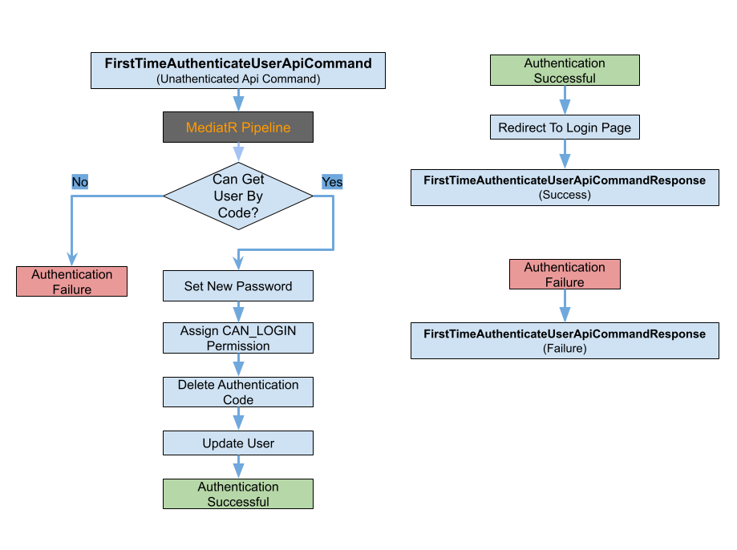

# Létrehozott Felhasználó Első Bejelntkezése

## Áttekintés
Az `ElsőBejelentkezés` funkció célja, hogy megkönnyítse az új felhasználók első bejelentkezését a rendszerbe. Fő célja annak biztosítása, hogy az új felhasználók biztonságosan és hatékonyan hozzáférjenek a rendszerhez először. Ez a funkció magában foglalja a felhasználó hitelesítését, a fiók beállítását és az elsődleges konfigurációs lépéseket, így kulcsfontosságú az új felhasználók onboarding folyamatában és a rendszer biztonságában.



## Folyamat Leírása

1. **Értesítések:**
    - A felhasználó részére e-mail értesítés kerül kiküldésre, amely tartalmazza a megadott e-mail címet és egy hivatkozást a bejelentkezési felülethez.
    - **Leírás**: A rendszer üdvözlő e-mailt küld a felhasználónak a profilja sikeres létrehozásáról, mely tartalmaz egy hivatkozást, amely átirányítja őt a FirstTimeSignIn.razor oldalra, ahol a befejező lépések elvégzésére kerül sor.

2. **Felhasználó Elindítja a Bejelentkezést:**
   - A felhasználó eléri a bejelentkezési oldalt, és megadja a hitelesítési kódját és az új jelszót.
   - **Komponens**: `FirstTimeSignIn.razor`
   - **Leírás**: A kliens komponens biztosítja a felhasználói felületet az első bejelentkezéshez. Begyűjti a felhasználó hitelesítési kódját és új jelszavát, és elküldi azokat a szervernek.

3. **API Kérés:**
   - Egy `POST` kérés küldésre kerül a `/api/v1/iam/user-initial-auth` végpontra a felhasználó hitelesítési kódjával és új jelszavával.
   - **Végpont**: `POST /api/v1/iam/user-initial-auth`
   - **Payload**:
     ```json
     {
       "authenticationCode": "string",
       "newPassword": "string"
     }
     ```
   - **Leírás**: Az ügyfél POST kérést küld az adott végpontra, amely tartalmazza a felhasználó hitelesítési kódját és új jelszavát.

4. **Érvényesítési Lépések:**
   - A rendszer érvényesíti a hitelesítési kódot az adatbázisban.
   - Ellenőrzi, hogy a felhasználó először jelentkezik-e be.
   - **Érvényesítő**: `FirstTimeAuthenticateUserApiCommandValidator`
   - **Leírás**: Az érvényesítő ellenőrzi, hogy a felhasználó által megadott új jelszó nem üres, ha az, akkor hibaüzenettel tájékoztatja a felhasználót.
5. **Parancs Feldolgozás:**
   - Ha érvényes, egy parancs kerül végrehajtásra, amely kezeli az első bejelentkezési folyamatot.
   - **Kezelő**: `FirstTimeAuthenticateUserCommandHandler`
   - **Leírás**: A parancs kezelője feldolgozza az érvényesített parancsot, frissíti a felhasználó státuszát az adatbázisban és elvégzi a további beállításokat.

6. **Adatbázis Interakciók:**
   - A felhasználó jelszava frissítésre kerül az adatbázisban.
   - **Tárhely**: `IUserRepository`
   - **Leírás**: A parancs kezelője az `IUserRepository`-t használja az adatbázis interakciók végrehajtására, frissítve a felhasználó státuszát és egyéb szükséges adatokat.

7. **Befejezés:**
    - A felhasználó megkapja a `CAN_LOGIN` jogosultságot, és átirányításra kerül a bejelentkezési oldalra.


## Szükséges Adatok az Első Bejelentkezéshez
Az első bejelentkezési folyamat sikeres végrehajtásához az alábbi adatok szükségesek:
- **Hitelesítési Kód**: A felhasználónak megadott hitelesítési kód.
- **Új Jelszó**: A felhasználó által beállított új jelszó.
- **Hitelesítési Token**: Egy hitelesítési token, amely megerősíti, hogy a kérést egy jogosult felhasználó küldi. Ezt általában a kérés fejléceiben szerepeltetik.

## Kliensoldali Komponensek
- **FirstTimeSignIn.razor**: Az első bejelentkezési folyamat felhasználói felületét biztosítja. Begyűjti a felhasználó hitelesítési kódját és új jelszavát, és elküldi azokat a szervernek.

## Szerveroldali Komponensek
- **Parancsok és Kezelők**:
   - `FirstTimeAuthenticateUserCommandHandler`: Parancskezelő, amely elvégzi az adatbázis műveleteket a `FirstTimeAuthenticateUserApiCommand`-tól megkapott adatokkal.
- **Érvényesítési Mechanizmusok**:
   - `FirstTimeAuthenticateUserApiCommandValidator`: Érvényesíti a felhasználó hitelesítési kódját. Biztosítja, hogy a hitelesítési kód érvényes legyen.
## Felhasználói Hitelesítési Folyamat
- **Személyes Kód**: Az első bejelentkezési folyamat elindításakor a felhasználó személyes kódot kap. Ezt a kódot használja az új jelszó beállításához.
- **Jelszó Beállítás**: A felhasználónak új jelszót kell beállítania a személyes kód felhasználásával. Ezen folyamat befejezéséig a felhasználó nem rendelkezik belépési jogosultsággal.

## Fiók Értesítése
- **Fiók Létrehozási Értesítés**: Amikor egy új felhasználói fiók létrejön, a felhasználó e-mail értesítést kap, amely tartalmazza a személyes kódját és a szükséges utasításokat az első bejelentkezési folyamat befejezéséhez. Így biztosítva van, hogy a felhasználó tisztában van új fiókjával és tudja, hogyan folytassa a jelszó beállítását és a rendszerhez való hozzáférést.

## API Végpontok
- **POST /api/v1/iam/user-initial-auth**
   - **Kérés Payload**:
      ```json
      {
         "authenticationCode": "string",
         "newPassword": "string"
      }
      ```
   - **Sikeres Válasz**:
      ```json
      {
         "Success": true,
         "Message": ""
      }
      ```

## Tesztelési Stratégia
- **Egység Tesztek**:
   - Ellenőrizze az egyes komponenseket, például az érvényesítőket és a kezelőket.
      - `Test_ValidAuthenticationCode_PassesValidation`: Ellenőrzi, hogy a hitelesítési kód érvényes-e, amikor helyes.
      - `Test_InvalidAuthenticationCode_ReturnsError`: Ellenőrzi, hogy a hitelesítési kód hibát ad vissza, amikor helytelen.
      - `Test_UserAlreadySignedIn_ReturnsError`: Ellenőrzi, hogy hibát ad vissza, ha a felhasználó már bejelentkezett.
- **Integrációs Tesztek**:
   - Tesztelje az API végpont és az adatbázis közötti interakciót.
      - `Test_ApiEndpoint_ValidAuthenticationCode_ReturnsSuccess`: Ellenőrzi, hogy az API végpont sikeres választ ad, ha érvényes hitelesítési kódot biztosítanak.
      - `Test_ApiEndpoint_InvalidAuthenticationCode_ReturnsError`: Ellenőrzi, hogy az API végpont hibát ad vissza, ha érvénytelen hitelesítési kódot biztosítanak.
- **Végponttól Végpontig (E2E) Tesztek**:
   - Szimulálja az egész első bejelentkezési folyamatot a felhasználó szemszögéből.
      - `Test_FullFlow_ValidAuthenticationCode_CompletesSignIn`: Ellenőrzi az egész folyamatot, biztosítva, hogy a felhasználó sikeresen bejelentkezhet egy érvényes hitelesítési kóddal.
      - `Test_FullFlow_InvalidAuthenticationCode_ReturnsError`: Ellenőrzi az egész folyamatot, biztosítva, hogy hibát ad vissza, ha érvénytelen hitelesítési kódot biztosítanak.
      - `Test_FullFlow_UserAlreadySignedIn_ReturnsError`: Ellenőrzi az egész folyamatot, biztosítva, hogy hibát ad vissza, ha a felhasználó már bejelentkezett.

## Összegzés
Az `ElsőBejelentkezés` funkció biztosítja a biztonságos és felhasználóbarát első bejelentkezési folyamatot. Teljes körű érvényesítést, biztonságos adatkezelést és felhasználói értesítéseket tartalmaz, magas szintű biztonsági, érvényesítési és használhatósági szabványoknak megfelelően.