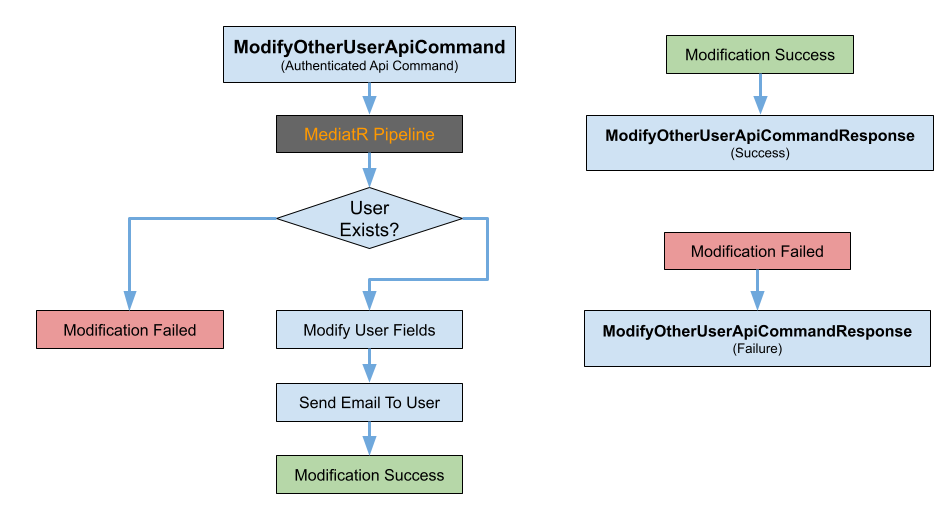

# Más Felhasználó Adatainak Módosítása

## Áttekintés
A `ModifyOtherUser` funkció lehetővé teszi az adminisztrátorok számára, hogy módosítsák a rendszerben lévő felhasználók adatait. Ez magában foglalja a felhasználói információk, például az email cím, telefonszám, látható név, jelszó és jogosultságok frissítését. Ez a funkció kulcsfontosságú a pontos felhasználói adatok fenntartásában és a felhasználói jogosultságok naprakész állapotának biztosításában.



## Folyamat Leírása
A `ModifyOtherUser` funkció a következő lépések szerint működik:

### Kliens Oldali Folyamat
1. **Felhasználói Felület**:
    - Az adminisztrátor belép a felhasználókezelő szakaszba az alkalmazásban.
    - Az adminisztrátor kiválasztja a módosítani kívánt felhasználót, és rákattint a "Szerkesztés" gombra.
    - Egy űrlap jelenik meg a felhasználó aktuális adataival, lehetővé téve az adminisztrátor számára a módosításokat.

2. **Űrlap Beküldés**:
    - Az adminisztrátor frissíti a szükséges mezőket (email, telefonszám, látható név, jelszó, jogosultságok).
    - Az adminisztrátor beküldi az űrlapot, ami kliensoldali validálást vált ki annak biztosítására, hogy minden szükséges mező kitöltött és érvényes legyen.

3. **API Kérés**:
    - Sikeres validálás után a kliens API kérést küld a szervernek a frissített felhasználói adatokkal.
    - **Végpont**: `PUT /api/v1/iam/users/{id}`
    - **HTTP Módszer**: `PUT`
    - **URL Útvonal**: `/api/v1/iam/users/{id}`
    - **Kérés Payload**:
      ```json
      {
        "ModifiedUser": {
          "Email": "newemail@example.com",
          "PhoneNumber": "06111111111",
          "VisibleName": "New Visible Name",
          "Password": "newPassword123",
          "PermissionSet": "newPermissionSet"
        }
      }
      ```

### Szerver Oldali Folyamat
1. **API Kérés Kezelés**:
    - A szerver megkapja az API kérést és azt az megfelelő vezérlőhöz irányítja.
    - A vezérlő kinyeri a felhasználó ID-ját az URL útvonalából és a frissített felhasználói adatokat a kérés payload-jából.

2. **Validálás**:
    - A `ModifyOtherUserApiCommandValidator` biztosítja, hogy a `ModifiedUser` mezők érvényesek legyenek, például ellenőrzi az email formátumot és a nem üres mezőket.
    - Példa validálási szabályok:
        - `Email` érvényes email címnek kell lennie és nem lehet üres.
        - `PhoneNumber` pontosan 11 karakter hosszúságú kell legyen.
        - `VisibleName` nem lehet üres.
        - `PermissionSet` érvényes jogosultság készletnek kell lennie.

3. **Parancs Feldolgozása**:
    - A `ModifyOtherUserCommandHandler` feldolgozza a parancsot azzal, hogy ellenőrzi, létezik-e a felhasználó.
    - Ha a felhasználó létezik, az adatai frissülnek az adatbázisban.
    - Ha a felhasználó nem létezik, hibaüzenet kerül visszaküldésre.

4. **Adatbázis Interakció**:
    - A kezelő az `IUserRepository`-t használja a felhasználói adatok frissítésére az adatbázisban.
    - A felhasználó adatai a megadott `ModifiedUser` adatok alapján frissülnek.

5. **Értesítések**:
    - Email értesítés kerül kiküldésre a felhasználó számára a fiókjában történt változtatásokról.
    - Az email tartalmazza a módosítások részleteit és új hitelesítő adatokat, ha a jelszó frissült.

### Részletes Lépések:
1. **API Kérés**:
    - Végpont: `PUT /api/v1/iam/users/{id}`
    - Payload:
      ```json
      {
        "ModifiedUser": {
          "Email": "newemail@example.com",
          "PhoneNumber": "06111111111",
          "VisibleName": "New Visible Name",
          "Password": "newPassword123",
          "PermissionSet": "newPermissionSet"
        }
      }
      ```

2. **Validálás**:
    - A `ModifyOtherUserApiCommandValidator` biztosítja, hogy a `ModifiedUser` mezők érvényesek legyenek, például ellenőrzi az email formátumot és a nem üres mezőket.

3. **Parancs Feldolgozása**:
    - A `ModifyOtherUserCommandHandler` feldolgozza a parancsot azzal, hogy ellenőrzi, létezik-e a felhasználó.
    - Ha a felhasználó létezik, az adatai frissülnek az adatbázisban.
    - Ha a felhasználó nem létezik, hibaüzenet kerül visszaküldésre.

4. **Adatbázis Interakció**:
    - A kezelő az `IUserRepository`-t használja a felhasználói adatok frissítésére az adatbázisban.

5. **Értesítések**:
    - Email értesítés kerül kiküldésre a felhasználó számára a fiókjában történt változtatásokról.

## Jogosultságkezelés
- **Szükséges Jogosultságok**: `CAN_MODIFY_OTHER_USER`
- **Felhasználói Szerepkörök**: Csak azok az adminisztrátorok, akik rendelkeznek a `CAN_MODIFY_OTHER_USER` jogosultsággal, módosíthatják más felhasználók adatait.

## API Végpontok
- **Végpont**: `PUT /api/v1/iam/users/{id}`
    - **HTTP Módszer**: `PUT`
    - **URL Útvonal**: `/api/v1/iam/users/{id}`
    - **Kérés Payload**:
      ```json
      {
        "ModifiedUser": {
          "Email": "newemail@example.com",
          "PhoneNumber": "06111111111",
          "VisibleName": "New Visible Name",
          "Password": "newPassword123",
          "PermissionSet": "newPermissionSet"
        }
      }
      ```
    - **Sikeres Válasz**:
      ```json
      {
        "Success": true,
        "Message": "Felhasználó sikeresen módosítva."
      }
      ```
    - **Hiba Válasz**:
      ```json
      {
        "Success": false,
        "Message": "Nem létező felhasználó."
      }
      ```

## Komponens Leírások
- **Parancsok és Kezelők**:
    - `ModifyOtherUserApiCommand`: A parancs, amely a felhasználó módosítási adatokat tartalmazza. Ezt a parancsot a kliens oldalon készítik el és küldik el a szervernek feldolgozásra.
    - `ModifyOtherUserCommandHandler`: A kezelő, amely feldolgozza a parancsot és frissíti a felhasználói adatokat. Ellenőrzi, hogy a felhasználó létezik-e, validálja az adatokat, és frissíti a felhasználói információkat az adatbázisban.

- **Validálási Mechanizmusok**:
    - `ModifyOtherUserApiCommandValidator`: A parancs payload érvényesítéséért felelős komponens, amely biztosítja, hogy minden szükséges mező jelen legyen és érvényes legyen. Ellenőrzi az email formátumot, a nem üres mezőket és a helyes telefonszám hosszúságot.

- **Adatátviteli Objektumok (DTO-k)**:
    - `UserDto`: Az adatátviteli objektum, amely a felhasználó adatait képviseli. Ezt az objektumot használják az adatok átvitelére a kliens és a szerver között, biztosítva, hogy a felhasználói információk megfelelően formázottak és teljesek legyenek.

- **Repository-k**:
    - `IUserRepository`: Felhasználói adatokat kezelő interfész. Lehetővé teszi a felhasználói információk lekérdezését és frissítését az adatbázisban.

- **Email Szolgáltatások**:
    - `IEmailService`: Az email értesítések küldéséért felelős interfész. Ezt használják a felhasználóknak küldött értesítések kiküldésére a fiókjukban történt változtatásokról.

## Tesztelési Stratégia
- **Egység Tesztek**:
    - Tesztek a `ModifyOtherUserCommandHandler`-hez, hogy biztosítsák a parancsok helyes feldolgozását érvényes és érvénytelen parancsok esetén.
    - Tesztek a `ModifyOtherUserApiCommandValidator`-hez, hogy biztosítsák a parancs payload megfelelő validálását.
    - Példa Egység Tesztek:
        - `Test_Handle_ValidCommand_UpdatesUserDetails`: Ellenőrzi, hogy a kezelő frissíti a felhasználó adatait, ha érvényes parancsot kap.
        - `Test_Handle_UserNotFound_ReturnsError`: Ellenőrzi, hogy a kezelő hibaüzenetet ad vissza, ha a felhasználó nem létezik.
        - `Test_Validator_ValidCommand_PassesValidation`: Ellenőrzi, hogy a parancs átmegy a validáláson, ha minden mező érvényes.
        - `Test_Validator_InvalidEmail_ReturnsError`: Ellenőrzi, hogy a validáló hibaüzenetet ad vissza, ha az email érvénytelen.
        - `Test_Validator_EmptyVisibleName_ReturnsError`: Ellenőrzi, hogy a validáló hibaüzenetet ad vissza, ha a látható név üres.

- **Integrációs Tesztek**:
    - Tesztek annak biztosítására, hogy a `ModifyOtherUser` funkció megfelelően interakcióba lép az adatbázissal és frissíti a felhasználói adatokat.
    - Példa Integrációs Tesztek:
        - `Test_ModifyOtherUser_Success`: Ellenőrzi, hogy a felhasználói adatok sikeresen frissülnek az adatbázisban.
        - `Test_ModifyOtherUser_UserNotFound`: Ellenőrzi, hogy hibaüzenet kerül visszaküldésre, ha a felhasználó nem létezik.

- **Végpont Tesztek (E2E)**:
    - Tesztek annak biztosítására, hogy a felhasználó módosításának teljes folyamata megfelelően működik, az API kéréstől a frissítésig az adatbázisban és az értesítés kiküldéséig.
    - Példa E2E Tesztek:
        - `Test_ModifyOtherUser_FullFlow_Success`: Ellenőrzi az egész folyamatot, beleértve az API kérést, adatbázis frissítést és email értesítést.
        - `Test_ModifyOtherUser_FullFlow_UserNotFound`: Ellenőrzi az egész folyamatot, biztosítva, hogy hibaüzenet kerül visszaküldésre, ha a felhasználó nem létezik.

## Összefoglalás
A `ModifyOtherUser` funkció elengedhetetlen az adminisztrátorok számára a felhasználói adatok kezelésében és frissítésében a rendszerben. Biztosítja, hogy a felhasználói adatok pontosak és naprakészek legyenek, valamint hogy a jogosultságok helyesen legyenek hozzárendelve. A funkció robusztus validálással, biztonságos feldolgozással és átfogó teszteléssel rendelkezik, hogy megfeleljen a biztonsági, validálási és használhatósági előírásoknak.