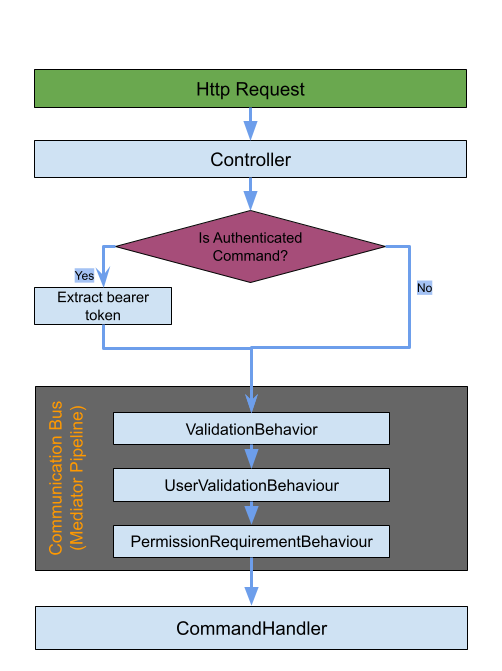

# Szerveroldali kérések feldolgozása

## Bevezetés

Ebben a dokumentumban azt fogjuk bemutatni, hogyan kerülnek a kérések feldolgozásra a szerveroldalon, közbe részletezve a rendszer különböző rétegeinek működését és szerepét.



## Http Request
- A `GenericApiCommandHandler` által lefuttatott http kérés megjelenik az URL-ben, amit az ASPNET elkap.
- Ebben szerepelnek olyan információk mint:
  - **Authorisation**: token
  - **Http metódusok**
  - **Metódusokhoz tartozó adatok**
  - **Kérés úticélja**

## Controller
- Megfelelő utasítással és endpointtal rendelkező Controllelen a kapott adatokat felkészíti , a MediatR pipeline-on keresztül, a Command Handlernek való átadását.
- Az átadás előtt azonban még áthalad az `ApiCommandBaseExtensions` osztályon. Ennek az a szerepe, hogy az `AuthenticatedApiCommandBase` és az `UnAuthenticatedApiCommandBase` osztályokból származtatottakat megkülönböztesse. Az előbbinél az osztály kinyeri az URL-ből a felhasználó tokenjét, míg az utóbbinál csak visszaküldi a bejövő kérést magát.

```c#
namespace vetcms.ServerApplication.Common.Abstractions.Api
{
    internal static class ApiCommandBaseExtensions
    {
        public static AuthenticatedApiCommandBase<T> Prepare<T>(this AuthenticatedApiCommandBase<T> command, HttpRequest request)
            where T : ICommandResult
        {
            string token = Utility.ExtractBearerToken(request);
            command.BearerToken = token;

            return command;
        }

        public static UnauthenticatedApiCommandBase<T> Prepare<T>(this UnauthenticatedApiCommandBase<T> command, HttpRequest request)
            where T : ICommandResult
        {
            return command;
        }
    }
}
```

## Server Behaviours

## Command Handler